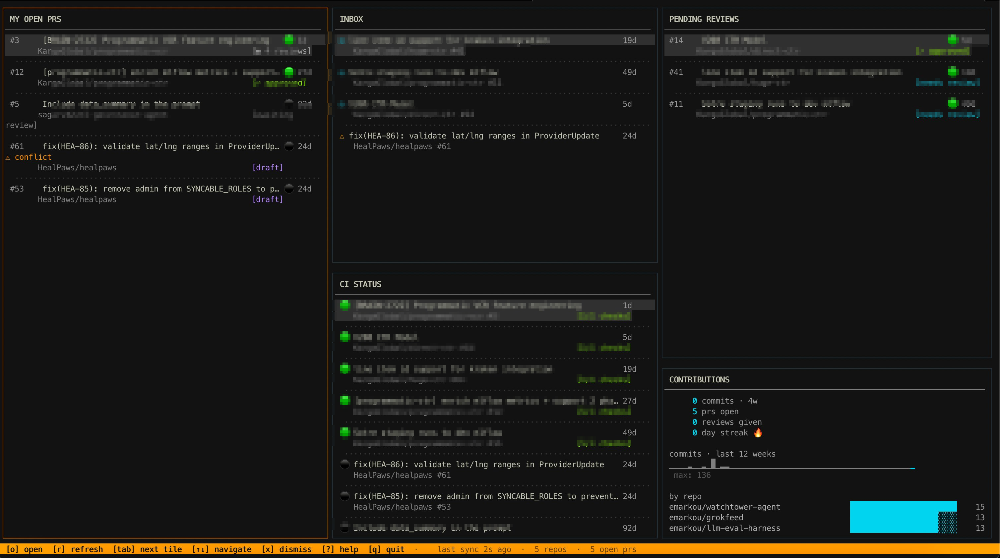

# prism

GitHub dashboard in your terminal — five live tiles: open PRs, inbox, pending reviews, CI status, contributions.

```
┌──────────────┬──────────────┬──────────────┐
│  MY OPEN PRS │  INBOX       │   PENDING    │
│              ├──────────────│   REVIEWS    │
│              │  CI STATUS   ├──────────────┤
│              │              │ CONTRIBUTIONS│
└──────────────┴──────────────┴──────────────┘
```



## Install

Requires Python 3.11+. Create a venv first:

```bash
python3.13 -m venv .venv
source .venv/bin/activate
pip install -e .
```

## Setup

If you use the `gh` CLI and are already logged in, just run:

```bash
prism
```

Token is picked up automatically from `gh auth token`. No export needed.

If you're not using `gh`, set the token manually:

```bash
export GITHUB_TOKEN=ghp_yourtoken
prism
```

Or add it to `~/.prism/config.toml`:

```toml
[auth]
token = "ghp_yourtoken"
```

Required token scopes: `repo`, `read:user`

## Config

Config lives at `~/.prism/config.toml` (created on first run).

```toml
[auth]
token = ""  # or use GITHUB_TOKEN env var, or gh CLI auth

[display]
refresh_seconds = 30
max_prs = 20
max_inbox = 20
max_ci_runs = 15

[repos]
# leave empty to auto-discover from recent activity
watched = []
# example:
# watched = ["myorg/backend", "myorg/frontend"]
```

## Keybindings

| Key | Action |
|-----|--------|
| `q` | quit |
| `r` | force refresh |
| `tab` | next tile |
| `shift+tab` | previous tile |
| `↑` / `k` | move up in tile |
| `↓` / `j` | move down in tile |
| `o` / `enter` | open in browser |
| `x` | dismiss inbox item (session only) |
| `m` | toggle draft (My PRs tile) |
| `?` | keybinding help overlay |
